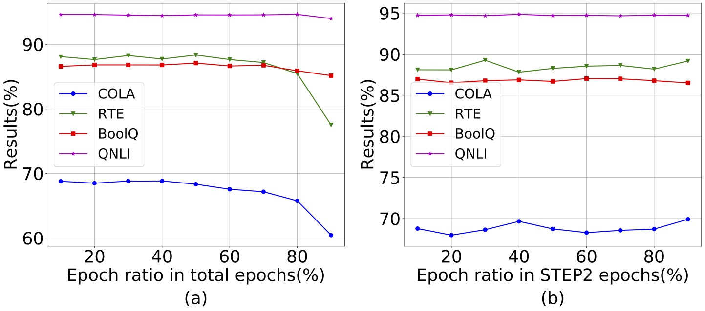
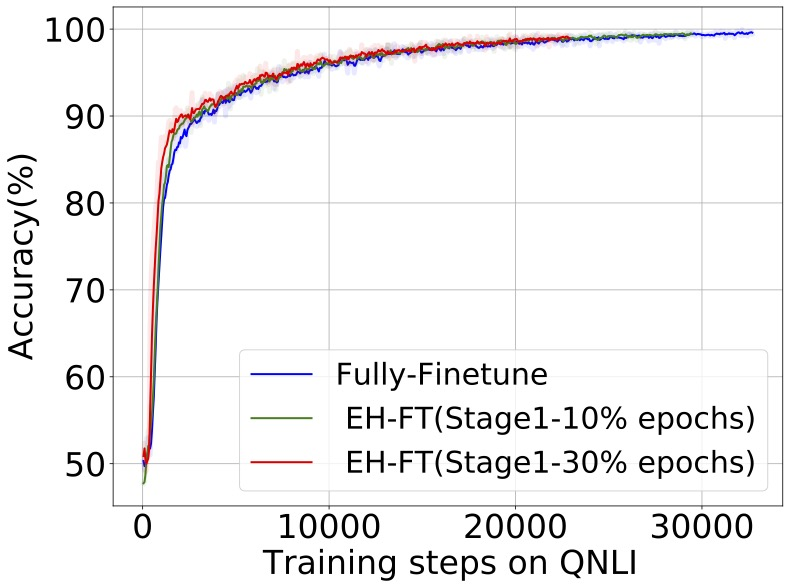

#supplementary experiments in qnli 

Figure 6: Ablation study on Stage 1 epochs of EH-FT_BitFit using RoBERTa-Large. (a) Results with different proportions of Stage1 epochs while keeping the total epochs fixed. Training model for more epochs in Stage
1 can not substitute fully-finetune. (b) Results with different proportions of Stage 1 epochs while keeping the
Stage 2 epochs fixed. Epochs of Stage 1 do not have a  significant effect on the results

Figure 7: Convergence rate with fully-finetune and EH-FT_BitFit Stage 2. For EH-FT, we draw the curve with
different Stage 1 epochs. Assisted by a good initialized head, the model can converge quickly in Stage 2.Increasing the training time of Stage 1 can increase the convergence rate of Stage 2. The difference is less obvious on large datasets like QNLI than on RTE and COLA.